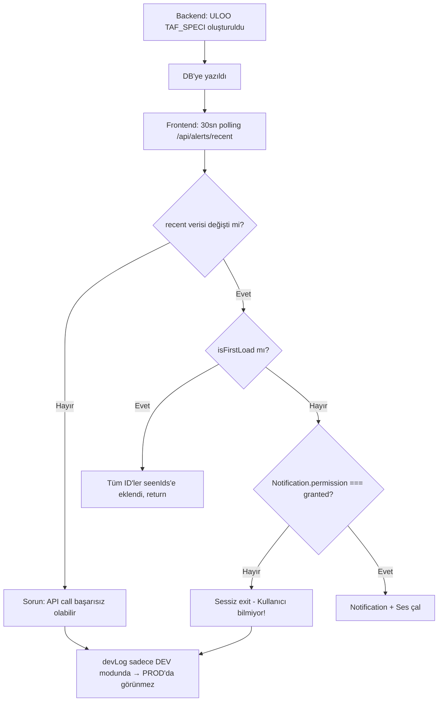

# Doğal Alert Bildirim Sistemi — Derin Analiz ve Çözüm

## Kök Neden Analizi



## Tespit Edilen Sorunlar

### 1. devLog Production'da Çalışmıyor (KRİTİK)
- `import.meta.env.DEV` production'da `false`
- Tüm debug log'ları kayboluyor
- Hiçbir hata görülmüyor

### 2. Notification Permission Durumu Gizli
- Kullanıcı izin vermemişse sessizce çıkış yapılıyor
- Kullanıcı neden bildirim almadığını bilmiyor
- Banner gösterilmiyor (dismiss edilmiş veya permission granted)

### 3. Ses Kontrolü
- `localStorage.getItem("aerosentinel-sound")` === `"0"` ise ses kısık
- Kullanıcı bunu bilmeyebilir

### 4. Polling Background Throttling
- 30sn polling arka planda 60sn+ olabilir
- `refetchIntervalInBackground: true` yeterli olmayabilir

## Çözüm

### Fix 1: devLog → her zaman log yazsın
```typescript
const devLog = (...args: unknown[]) => {
  console.log("[AeroNotif]", ...args);
};
```

### Fix 2: Notification durumunu UI'da göster
- Permission "default" → banner göster (zaten var)
- Permission "denied" → kırmızı uyarı göster (zaten var)  
- Permission "granted" ama bildirim gelmiyor → polling durumunu göster

### Fix 3: Polling hızını artır
- 30sn → 15sn
- `refetchIntervalInBackground: true` korunacak

### Fix 4: Notification.create() sonrası fallback
- Browser notification başarısız olursa toast notification göster
- Ses başarısız olursa konsola uyarı yaz
