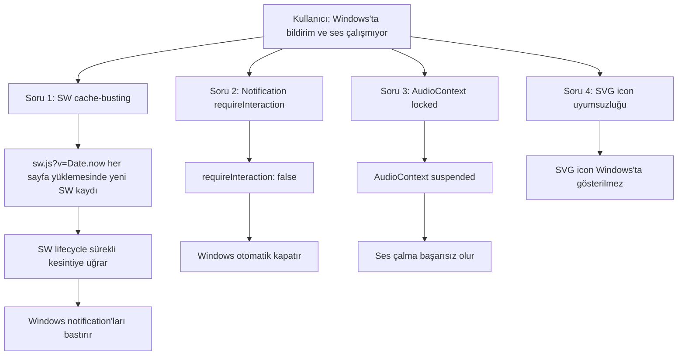

# Windows Bildirim & Ses Sorunu + Deployment Güvenliği Planı

## 1. Sorun Analizi

### 1.1. Tespit Edilen Kök Nedenler



**Soru 1 — Service Worker Cache-Busting (KRİTİK)**
- Dosya: `artifacts/aero-sentinel/index.html:83`
- `navigator.serviceWorker.register('/sw.js?v=' + Date.now())`
- Her sayfa yüklemesinde `Date.now()` farklı bir URL oluşturur
- Eski SW her seferinde yenisiyle değiştirilir
- `install` → `skipWaiting` → `activate` → `clients.claim()` döngüsü her yüklemede çalışır
- Windows, SW'si sürekli değişen sitelerin notification'larını bastırabilir

**Soru 2 — Notification requireInteraction**
- Dosya: `artifacts/aero-sentinel/src/hooks/useAlertNotifications.ts:131`
- `requireInteraction: false` — Windows otomatik olarak bildirimi kapatır
- Kullanıcı farkına varmadan bildirim kaybolur

**Soru 3 — AudioContext Locked**
- Dosya: `artifacts/aero-sentinel/src/hooks/useAlertSound.ts`
- `ensureAudioContext()` sadece bir kez çalışır (`_initialized` flag)
- İlk kullanıcı etkileşimi olmadan AudioContext `suspended` kalır
- Notification geldiğinde ses çalınamaz

**Soru 4 — SVG Icon**
- Dosya: `artifacts/aero-sentinel/src/hooks/useAlertNotifications.ts:129`
- `icon: \`${import.meta.env.BASE_URL}alert-icon.svg\``
- Windows notification sistemi SVG iconları desteklemez/duzgun gostermez
- PNG icon daha uyumludur

---

## 2. Çözüm Planı

### 2.1. Service Worker Düzeltilmesi

**Dosya:** `artifacts/aero-sentinel/index.html`

**Değişiklik:** `Date.now()` yerine statik versiyon numarası kullan

```html
<!-- MEVCUT (HATALI) -->
<script>
  if ('serviceWorker' in navigator) {
    window.addEventListener('load', () => {
      navigator.serviceWorker.register('/sw.js?v=' + Date.now());
    });
  }
</script>

<!-- YENİ (DOĞRU) -->
<script>
  if ('serviceWorker' in navigator) {
    window.addEventListener('load', () => {
      navigator.serviceWorker.register('/sw.js');
    });
  }
</script>
```

**Neden:** SW sadece bir kez kaydedilir, tarayıcı kendi update mekanizmasını kullanır. Cache busting SW lifecycle'ı bozar.

### 2.2. Notification requireInteraction

**Dosya:** `artifacts/aero-sentinel/src/hooks/useAlertNotifications.ts`

**Değişiklik:** `requireInteraction: true` yap

```typescript
// MEVCUT (satır ~131)
requireInteraction: false,

// YENİ
requireInteraction: true,
```

**Neden:** Windows'ta bildirim otomatik kapanmaz, kullanıcı tıklayana kadar kalır.

### 2.3. AudioContext Unlock İyileştirmesi

**Dosya:** `artifacts/aero-sentinel/src/hooks/useAlertSound.ts`

**Değişiklik:** `playAlertSound()` fonksiyonunda AudioContext'i zorla resume et

```typescript
// MEVCUT
export function playAlertSound() {
  const t = getCtx().currentTime;
  playTone(1200, 0.15, t, 0.25, "sine");
  // ...
}

// YENİ
export function playAlertSound() {
  const ctx = getCtx();
  // AudioContext suspended ise resume et
  if (ctx.state === "suspended") {
    ctx.resume().catch(() => {});
  }
  const t = ctx.currentTime;
  playTone(1200, 0.15, t, 0.25, "sine");
  // ...
}
```

Ayrıca `setupAudioUnlock` fonksiyonuna `pointerdown` event'i de ekle:

```typescript
window.addEventListener("pointerdown", unlock, { once: true });
```

### 2.4. PNG Icon Desteği

**Dosya:** `artifacts/aero-sentinel/src/hooks/useAlertNotifications.ts`

**Değişiklik:** SVG yerine PNG icon kullan

```typescript
// MEVCUT (satır ~129)
icon: `${import.meta.env.BASE_URL}alert-icon.svg`,

// YENİ
icon: `${import.meta.env.BASE_URL}alert-icon.png`,
```

**Not:** `alert-icon.png` dosyası `public/` dizinine eklenmeli (mevcut SVG'den PNG'ye çevrilerek).

### 2.5. Deployment Güvenliği

**Durum Analizi:**
- Mevcut `wrangler pages deploy` zaten preview branch'ine deploy ediyor
- Preview URL: `preview.aerosentinel.pages.dev`
- Production: `aerosentinel.app` (ayrı branch)
- Bu yapı zaten güvenli — preview deploy'ları production'ı etkilemez

**Önerilen İyileştirme:** Deploy script'lerini netleştir

**Dosya:** `artifacts/aero-sentinel/package.json`

```json
{
  "scripts": {
    "deploy:preview": "vite build --config vite.config.ts && wrangler pages deploy dist/public --project-name=aerosentinel --branch=preview",
    "deploy:production": "vite build --config vite.config.ts && wrangler pages deploy dist/public --project-name=aerosentinel --branch=production"
  }
}
```

**Alternatif:** Root `package.json`'a deploy script'leri ekle

---

## 3. Değişiklik Özeti

| # | Dosya | Değişiklik | Öncelik |
|---|-------|-----------|---------|
| 1 | `index.html` | SW registration'dan `?v=Date.now()` kaldır | KRİTİK |
| 2 | `useAlertNotifications.ts` | `requireInteraction: true` | YÜKSEK |
| 3 | `useAlertSound.ts` | AudioContext resume + `pointerdown` unlock | YÜKSEK |
| 4 | `useAlertNotifications.ts` | SVG → PNG icon | ORTA |
| 5 | `public/alert-icon.png` | PNG icon dosyası oluştur | ORTA |
| 6 | `package.json` | Deploy script'leri ekle | DÜŞÜK |

---

## 4. Uygulama Sırası

1. `index.html` — SW cache-busting kaldır (KRİTİK, tek başına bile büyük fark yaratır)
2. `useAlertNotifications.ts` — `requireInteraction: true` + PNG icon
3. `useAlertSound.ts` — AudioContext unlock iyileştirmesi
4. `public/alert-icon.png` — PNG icon oluştur
5. `package.json` — Deploy script'leri
6. Preview deploy ile test et
