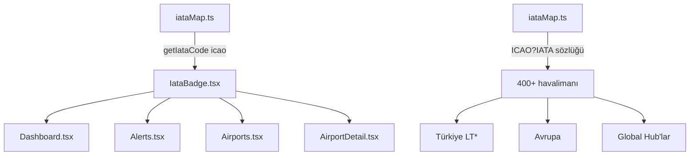

# IATA Kodu Özelliği — Uygulama Planı

## Özet

ICAO kodlarının yanında 3 karakterli IATA kodlarını küçük ve şık bir tasarımla göstermek.

---

## 1. Mevcut Durum Analizi

ICAO kodlarının görüntülendiği tüm lokasyonlar:

| Sayfa / Bileşen | Satır(lar) | Mevcut Görüntü |
|-----------------|------------|-----------------|
| Dashboard — watchlist badge | 358-359 | `{icao}` → "LTFM" |
| Dashboard — weather card header | 619-620 | `{icao}` → "LTFM" |
| Dashboard — watchlist input placeholder | 366 | "LTFJ,LTAC,LTFM" |
| Alerts — alert ICAO link | 340 | `{alert.icao}` → "LTFM" |
| Airports — FROM sütunu | 1054-1057 | `{f.fromIcao}` |
| Airports — TO sütunu | 1059-1062 | `{f.toIcao}` |
| AirportDetail — başlık | 62-63 | `{icao}` → "LTFM" |

---

## 2. Önerilen Çözüm Mimarisi



### 2.1. `lib/iataMap.ts` — ICAO → IATA Sözlüğü

- **Export**: `getIataCode(icao: string): string | undefined`
- **Export**: `getDisplayIcao(icao: string): string` — "LTFM (IST)" formatında döndürür
- **Veri kaynağı**: Statik TypeScript sözlüğü (`Record<string, string>`)
- **Kapsam**: ~400+ havalimanı (tüm Türkiye + Avrupa + global hub'lar)
- **Bakım**: Yeni havalimanları kolayca eklenebilir

### 2.2. `components/IataBadge.tsx` — Şık IATA Bileşeni

```tsx
interface Props {
  icao: string;
  /** Varsayılan: "sm" — "sm" veya "xs" */
  size?: "xs" | "sm";
  /** Varsayılan: true — IATA bilinmiyorsa gizle */
  hideIfMissing?: boolean;
}
```

**Tasarım:** IATA kodu, ICAO kodunun yanında küçük bir badge olarak görünür.
- Arka plan: yarı saydam muted renk
- Yazı: küçük (`text-[10px]`), monospace, hafif
- Border: ince, yarı saydam
- Hover: preview hissi

### 2.3. Ekran Görüntüsü (Örnek)

```
[LTFM]        →    [LTFM]  [IST]
[LTFJ]        →    [LTFJ]  [SAW]
[EGLL]        →    [EGLL]  [LHR]
[XXXX]        →    [XXXX]  (gösterilmez, hideIfMissing=true)
```

---

## 3. Uygulama Adımları

### Adım 1: `lib/iataMap.ts` — Veritabanı
- `Record<string, string>` sözlüğü oluştur
- `getIataCode()` ve `getDisplayIcao()` fonksiyonlarını yaz
- Türkiye havalimanları (LT**): LTFM→IST, LTFJ→SAW, LTBA→ISL, LTAC→ESB, LTAI→AYT, LTBS→DLM, LTCG→TZX, LTCE→ERZ, vb.
- Avrupa: EGLL→LHR, EGKK→LGW, LFPG→CDG, LFPO→ORY, EDDF→FRA, EDDM→MUC, EHAM→AMS, LIRF→FCO, LEMD→MAD, LEBL→BCN, vb.
- Global: KLAX→LAX, KJFK→JFK, KORD→ORD, KIAD→IAD, OMDB→DXB, RJTT→HND, RJBB→KIX, VHHH→HKG, WSSS→SIN, VTBS→BKK, RCTP→TPE, ZBAA→PEK, ZSSS→SHA, RKSI→ICN, vb.

### Adım 2: `components/IataBadge.tsx`
- IATA kodunu küçük, şık bir badge ile gösteren bileşen
- Farklı boyut seçenekleri (`xs`, `sm`)
- IATA bilinmiyorsa gizleme seçeneği
- Stil: `text-[10px] font-mono text-muted-foreground/70 border border-border/50 rounded px-1`

### Adım 3-7: Sayfa Güncellemeleri
Her bir sayfada ICAO kodunun göründüğü yere `<IataBadge icao={icao} />` eklenir.

### Adım 8: Test
- Tüm sayfalarda IATA kodlarının doğru göründüğünü kontrol et
- Bilinmeyen ICAO'ların gizlendiğini kontrol et

---

## 4. Değişiklik Detayları

### Dashboard.tsx — Watchlist Badge (mevcut ~line 358)

```
{/* Mevcut */}
<span key={icao} ...>
  {icao}
  <button ...>✕</button>
</span>

{/* Yeni */}
<span key={icao} ...>
  {icao} <IataBadge icao={icao} size="xs" />
  <button ...>✕</button>
</span>
```

### Dashboard.tsx — Weather Card Header (mevcut ~line 620)

```
{/* Mevcut */}
<span className="font-mono font-bold text-base tracking-wider">{icao}</span>

{/* Yeni */}
<span className="font-mono font-bold text-base tracking-wider inline-flex items-center gap-1.5">
  {icao}
  <IataBadge icao={icao} />
</span>
```

### Alerts.tsx — Alert Link (mevcut ~line 340)

```
{/* Mevcut */}
<Link href={`/airports/${alert.icao}`} className="font-mono font-bold text-sm hover:underline">
  {alert.icao}
</Link>

{/* Yeni */}
<Link href={`/airports/${alert.icao}`} className="font-mono font-bold text-sm hover:underline inline-flex items-center gap-1.5">
  {alert.icao}
  <IataBadge icao={alert.icao} />
</Link>
```

### Airports.tsx — FROM/TO Sütunları (mevcut ~line 1054-1062)

```
{/* Mevcut */}
<Link href={`/airports/${f.fromIcao}`} className="text-sky-400 hover:underline">{f.fromIcao}</Link>

{/* Yeni oval şık tasarım */}
<div className="flex flex-col items-start gap-0.5">
  <Link href={`/airports/${f.fromIcao}`} className="text-sky-400 hover:underline font-semibold tracking-wide">{f.fromIcao}</Link>
  <IataBadge icao={f.fromIcao} size="xs" />
</div>
```

### AirportDetail.tsx — Başlık (mevcut ~line 62-63)

```
{/* Mevcut */}
<h2 className="text-3xl font-bold font-mono text-primary">{icao}</h2>

{/* Yeni */}
<h2 className="text-3xl font-bold font-mono text-primary inline-flex items-center gap-2">
  {icao}
  <IataBadge icao={icao} size="sm" />
</h2>
```
