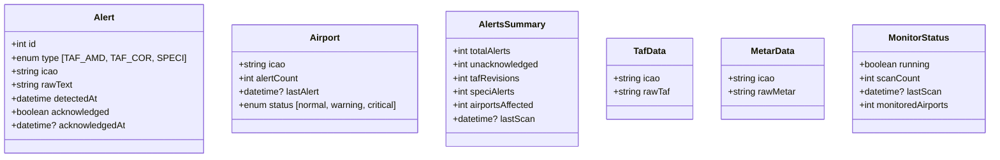
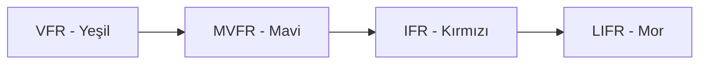
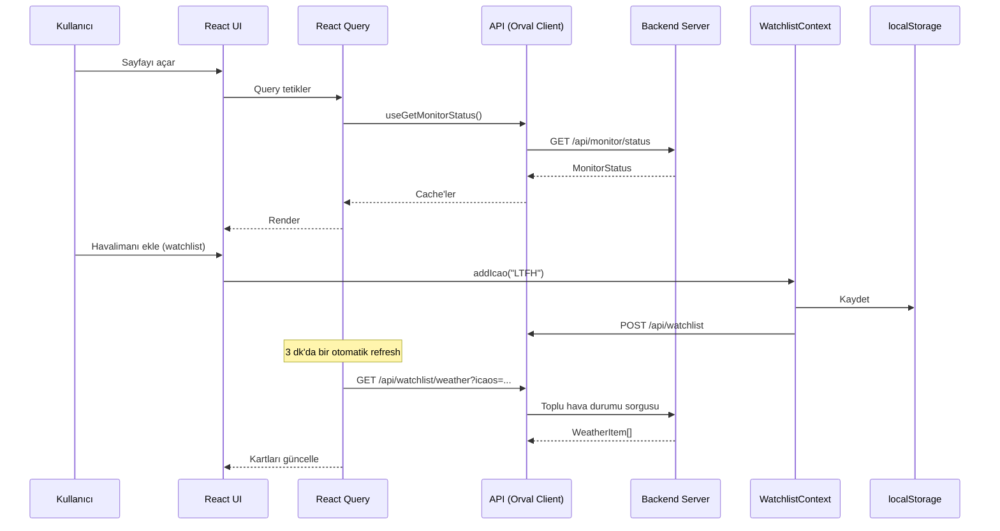

# AeroSentinel — Proje Yapısı ve Mimari Rapor

## 1. Genel Bakış

**AeroSentinel**, havacılık hava durumu izleme (aviation weather monitoring) sistemi için geliştirilmiş bir web uygulamasıdır. **pnpm workspace** tabanlı monorepo yapısındadır. Uygulama, havalimanları için METAR/TAF raporlarını alır, analiz eder, uyarılar (alert) oluşturur ve kullanıcıya görsel olarak sunar.

---

## 2. Monorepo Yapısı

```
aerosentinel/
├── package.json                    # Workspace root (pnpm workspace)
├── .replit / .gitignore / .npmrc   # Platform/yapılandırma
│
├── artifacts/
│   ├── aero-sentinel/              # ANA UYGULAMA (React + Vite)
│   │   ├── src/
│   │   │   ├── App.tsx             # Router, Context'ler, temas
│   │   │   ├── main.tsx            # Giriş noktası
│   │   │   ├── index.css           # Global stiller
│   │   │   ├── pages/
│   │   │   │   ├── Dashboard.tsx        # Ana sayfa (692 satır)
│   │   │   │   ├── Alerts.tsx           # Uyarı listesi (376 satır)
│   │   │   │   ├── Airports.tsx         # Havalimanları + Excel (1104 satır)
│   │   │   │   ├── AirportDetail.tsx    # Havalimanı detay (180 satır)
│   │   │   │   └── not-found.tsx
│   │   │   ├── components/
│   │   │   │   ├── NavHeader.tsx
│   │   │   │   ├── Footer.tsx
│   │   │   │   ├── AlertBadge.tsx
│   │   │   │   ├── ClockDisplay.tsx
│   │   │   │   ├── TafText.tsx
│   │   │   │   ├── ColoredRawText.tsx
│   │   │   │   ├── ChangelogModal.tsx
│   │   │   │   └── ui/ (shadcn/ui — 50+ komponent)
│   │   │   ├── context/
│   │   │   │   └── WatchlistContext.tsx  # İzleme listesi yönetimi
│   │   │   ├── hooks/
│   │   │   │   ├── useAlertNotifications.ts
│   │   │   │   ├── usePersistedState.ts
│   │   │   │   ├── useTheme.ts
│   │   │   │   ├── use-mobile.tsx
│   │   │   │   └── use-toast.ts
│   │   │   └── lib/
│   │   │       ├── metarParser.ts    # METAR/TAF ayrıştırıcı (564 satır)
│   │   │       ├── icaoUtils.ts
│   │   │       └── utils.ts
│   │   └── package.json
│   │
│   └── mockup-sandbox/             # UI prototip ortamı
│       └── src/
│           ├── App.tsx
│           └── .generated/mockup-components.ts
│
├── lib/
│   ├── api-spec/
│   │   ├── openapi.yaml            # OpenAPI 3.1 spesifikasyonu (280 satır)
│   │   └── orval.config.ts         # Orval kod üreteci yapılandırması
│   ├── api-client-react/           # Generated React API istemcisi
│   │   └── src/generated/
│   │       ├── api.ts              # React Query hooks
│   │       └── api.schemas.ts      # TypeScript tipleri
│   ├── api-zod/                    # Generated Zod validasyon şemaları
│   │   └── src/generated/types/
│   │       ├── airport.ts, alert.ts, metarData.ts, tafData.ts, ...
│   └── db/                         # Veritabanı katmanı
│       └── src/index.ts
│
├── scripts/                        # Yardımcı scriptler
└── attached_assets/                 # Görsel ve referans dosyaları
```

---

## 3. Teknoloji Yığını

| Katman            | Teknoloji                              |
| ----------------- | -------------------------------------- |
| **Framework**     | React 19 + TypeScript 5.9             |
| **Build**         | Vite + @vitejs/plugin-react           |
| **Routing**       | wouter (hafif, hook tabanlı)          |
| **State/Data**    | @tanstack/react-query v5              |
| **Stil**          | Tailwind CSS v4 + shadcn/ui           |
| **Animasyon**     | framer-motion                         |
| **Grafik**        | recharts                              |
| **Tarih**         | date-fns                              |
| **Validasyon**    | zod                                   |
| **Form**          | react-hook-form                       |
| **API İstemci**   | Orval ile OpenAPI'dan üretilmiş       |
| **Monorepo**      | pnpm workspaces                       |
| **Paket Yön.**    | pnpm                                  |

---

## 4. Sayfa ve Rota Yapısı

```
/                    → Dashboard    (İzleme listesi, TAF/METAR kartları)
/alerts              → Alerts       (Uyarı listesi, filtreleme, onaylama)
/airports            → Airports     (Havalimanı listesi + Excel yükleme)
/airports/:icao      → AirportDetail (Tek havalimanı detay, TAF/METAR, uyarılar)
```

### Dashboard Ana Özellikleri
- İzleme listesindeki havalimanları için TAF/METAR görüntüleme
- Kategori filtreleme (VFR/MVFR/IFR/LIFR + Critical)
- Sort: A–Z, Worst First, Best First
- Görünüm: TAF / METAR / BOTH
- Zaman dilimi filtreleme
- DOM/INT rot filtresi
- Watchlist yönetimi (ekle/çıkar/temizle)
- Monitör durum göstergesi (LIVE yeşil nokta)

### Alerts Sayfası
- Alert türü filtreleme (TAF AMD, TAF COR, SPECI)
- Onaylanmış/onaylanmamış filtreleme
- Sort: Newest / Oldest / ICAO A–Z
- Lokal ACK (onaylama) state yönetimi
- Özet istatistik kartları

### Airports Sayfası
- Tüm havalimanları listesi (durum, uyarı sayısı)
- Excel yükleme ile uçuş planı içe aktarma
- Sürükle-bırak ile uçuş planı düzenleme
- METAR tabanlı kategori analizi
- Havalimanı bazlı uyarı görüntüleme

---

## 5. API Endpoints (OpenAPI 3.1)

| Metot  | Path                            | Açıklama                    |
| ------ | ------------------------------- | --------------------------- |
| GET    | `/api/healthz`                  | Sağlık kontrolü             |
| GET    | `/api/alerts`                   | Uyarıları listele           |
| GET    | `/api/alerts/summary`           | Uyarı özet istatistikleri   |
| GET    | `/api/alerts/recent`            | Son 10 uyarı                |
| PATCH  | `/api/alerts/{id}/acknowledge`  | Uyarı onaylama              |
| GET    | `/api/airports`                 | Havalimanlarını listele     |
| GET    | `/api/airports/{icao}/taf`      | TAF verisi al               |
| GET    | `/api/airports/{icao}/metar`    | METAR verisi al             |
| GET    | `/api/monitor/status`           | Monitör durumu              |
| PUT    | `/api/watchlist/sync`           | Watchlist senkronizasyon    |
| POST   | `/api/watchlist`                | Havalimanı ekle             |
| DELETE | `/api/watchlist`                | Tümünü temizle              |
| DELETE | `/api/watchlist/{icao}`         | Havalimanı çıkar            |

### Veri Tipleri (Şemalar)



---

## 6. METAR/TAF İşleme Mimarisi

metarParser.ts (564 satır) aşağıdaki yeteneklere sahiptir:

- **METAR ayrıştırma**: Rüzgar, bulut katmanları, görüş, CAVOK, fenomen (hava olayları)
- **Flight Category hesaplama**: VFR / MVFR / IFR / LIFR (görüş ve tavan yüksekliğine göre)
- **TAF analizi**: Zaman dilimleri (FM, TEMPO, BECMG), en kötü kategori
- **Kritik hava durumu tespiti**: Turuncu/kırmızı kodlu fenomenler
- **Rüzgar analizi**: Şiddetli rüzgar uyarıları (≥25 KT sustained / ≥29 KT gust)

### Uçuş Kategorileri ve Renk Kodları



---

## 7. State Yönetimi

| State             | Yöntem                 | Kapsam        |
| ----------------- | ---------------------- | ------------- |
| Tema (dark/light) | React Context          | Global        |
| Watchlist         | React Context + localStorage | Global  |
| Local ACK        | React Context + localStorage | Global  |
| Dashboard filtreleri | usePersistedState | Sayfa |
| API verileri      | @tanstack/react-query  | Cache         |

---

## 8. Dikkat Çeken Noktalar ve Potansiyel İyileştirmeler

1. **Airports.tsx (1104 satır)** — Çok büyük bir dosya, refactor edilmeli.
2. **metarParser.ts (564 satır)** — Oldukça kapsamlı, ancak test edilebilirliği düşük.
3. **Dashboard.tsx (692 satır)** — Büyük bir dosya, bileşenlere ayrıştırılabilir.
4. **API istemcisi** — Orval ile OpenAPI'dan üretiliyor, şema değişikliklerinde yeniden üretilmeli.
5. **Watchlist senkronizasyonu** — localStorage + backend API çift yönlü senkronizasyon.
6. **Excel desteği** — Havacılık uçuş planlarını `.xlsx`'den içe aktarma özelliği.
7. **Bildirimler** — Browser Notification API ile masaüstü uyarıları.

---

## 9. Uygulama İçi Veri Akışı



---

## 10. Hedefler / Yol Haritası

1. **Kod Kalitesi**: Büyük dosyaları refactor etme (Airports.tsx, Dashboard.tsx, metarParser.ts)
2. **Test Altyapısı**: METAR ayrıştırıcı için unit testler
3. **Yeni Özellikler**: Harita görünümü, daha detaylı grafikler, e-posta bildirimleri
4. **Performans**: Büyük alert listelerinde sanallaştırma
5. **Erişilebilirlik**: shadcn/ui komponentleri ile erişilebilirlik iyileştirmeleri