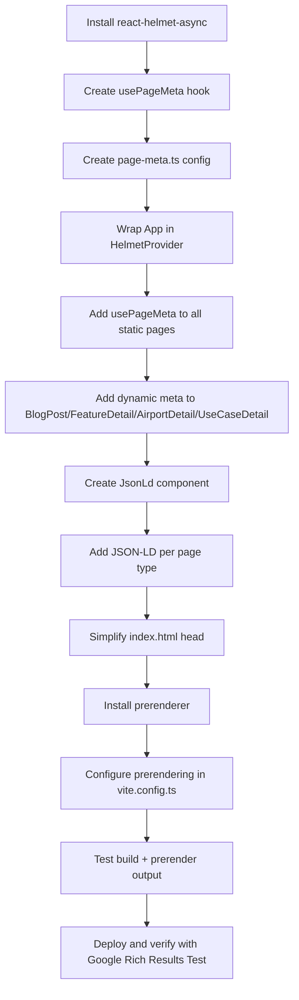

# SEO/GEO Diagnosis & Solution Plan — AERO-SENTINEL

## 1. Diagnosis Results

### Framework & Architecture
- **Framework**: React 18+ SPA with Vite — client-side rendering only
- **Router**: `wouter` — lightweight client-side router
- **Deployment**: Cloudflare Pages (static hosting, `dist/public`)
- **SSR/SSG**: ❌ None — no SSR/SSG plugins in [`vite.config.ts`](artifacts/aero-sentinel/vite.config.ts)
- **SEO library**: ❌ None installed — no `react-helmet-async` or equivalent

### Current HTML Rendering Behavior
Every route (`/`, `/about`, `/alerts`, `/airports/ICAO`, etc.) serves the **exact same `index.html`** file from Cloudflare Pages. The SPA then hydrates client-side and renders the correct page via `wouter` routing.

**Impact**: All crawlers and AI systems see identical meta tags for every URL.

### Current Meta Tags in [`index.html`](artifacts/aero-sentinel/index.html)
The homepage `index.html` has extensive, well-written SEO content:

| Element | Status | Issue |
|---------|--------|-------|
| `<title>` | ✅ Present | Same for ALL routes |
| `<meta description>` | ✅ Present | Same for ALL routes |
| `<link canonical>` | ✅ Present | Hardcoded to `https://aerosentinel.app` — wrong for subpages |
| `og:title` | ✅ Present | Same for ALL routes |
| `og:description` | ✅ Present | Same for ALL routes |
| `og:url` | ✅ Present | Hardcoded to `https://aerosentinel.app` |
| `og:image` | ✅ Present | `/opengraph.jpg` — same for ALL routes |
| `twitter:card` | ✅ Present | Same for ALL routes |
| JSON-LD | ✅ WebApplication schema | Only on homepage, not per-page |
| `robots` | ✅ `index, follow` | Correct |
| `keywords` | ✅ Present | Generic, not per-page |

### Key SEO Problems Identified

1. **Duplicate meta tags across all routes** — Google and AI crawlers see the same title/description for `/about`, `/alerts`, `/blog/xyz`, etc. This is the #1 SEO problem.

2. **Canonical tag is static** — Always points to `https://aerosentinel.app` even on `/about`, `/alerts`, etc. Google may penalize or ignore subpages.

3. **No `document.title` updates** — Searched all `.tsx` files — zero `document.title` assignments found. The browser tab always shows the same title.

4. **No per-page JSON-LD structured data** — Blog posts should have `Article` schema, FAQ page should have `FAQPage` schema, features should have `SoftwareApplication` schema, etc.

5. **No prerendering for static routes** — Non-JS crawlers (some AI systems, social media previews) see empty `<div id="root"></div>`.

6. **GEO (Generative Engine Optimization) gap** — AI search engines (ChatGPT, Perplexity, Gemini) rely on structured data and clear per-page content signals. Without dynamic meta tags, these engines may not properly index or cite the site's content.

### What's Already Done Well
- ✅ Comprehensive `sitemap.xml` with 38+ URLs
- ✅ Proper `robots.txt` with sitemap reference
- ✅ Security headers in `_headers`
- ✅ PWA `manifest.json`
- ✅ OG image at `/opengraph.jpg`
- ✅ Excellent blog content (14+ long-form articles)
- ✅ Feature and use-case detail pages with rich content
- ✅ Cloudflare Pages `_routes.json` configured

---

## 2. Recommended Solution

### Approach: Option A (react-helmet-async) + Cloudflare Pages prerendering

**Why this approach:**
- Minimal migration risk — no framework change needed
- Googlebot renders JavaScript, so `react-helmet-async` works for Google
- `vite-plugin-prerender` generates static HTML for key routes at build time
- Works within existing Cloudflare Pages deployment
- JSON-LD structured data can be injected per-page for GEO

**Why NOT Option B (vite-plugin-ssr / full SSR):**
- Overkill for this project — massive refactor of routing, build, and deployment
- Cloudflare Pages doesn't natively support Node SSR without Workers

**Why NOT Option C (Cloudflare Workers middleware):**
- Adds complexity at the edge layer
- Harder to maintain — meta tag logic lives outside the React app
- Doesn't solve the client-side `document.title` problem

---

## 3. Implementation Plan

### Phase 1: Install & Configure react-helmet-async

1. **Install `react-helmet-async`**
   ```bash
   pnpm add react-helmet-async
   ```

2. **Wrap app in `HelmetProvider`** in [`src/main.tsx`](artifacts/aero-sentinel/src/main.tsx) or [`src/App.tsx`](artifacts/aero-sentinel/src/App.tsx)

3. **Create `usePageMeta` hook** at `src/hooks/usePageMeta.ts`
   - Accepts `{ title, description, canonical, ogImage, ogType, jsonLd }` config
   - Sets `<title>`, `<meta>`, `<link canonical>`, Open Graph tags, and JSON-LD
   - Provides sensible defaults fallback to homepage values

4. **Create `src/lib/page-meta.ts`** — centralized metadata definitions for all static routes:
   - `/` — homepage
   - `/alerts` — alerts dashboard
   - `/airports` — airport listing
   - `/about` — about page
   - `/privacy` — privacy policy
   - `/terms` — terms of service
   - `/contact` — contact page
   - `/blog` — blog listing
   - `/features` — features listing
   - `/faq` — FAQ page
   - `/use-cases` — use cases listing

### Phase 2: Apply Meta Tags to Each Page

5. **Add `usePageMeta()` call to each page component**:
   - [`src/pages/Dashboard.tsx`](artifacts/aero-sentinel/src/pages/Dashboard.tsx)
   - [`src/pages/Alerts.tsx`](artifacts/aero-sentinel/src/pages/Alerts.tsx)
   - [`src/pages/Airports.tsx`](artifacts/aero-sentinel/src/pages/Airports.tsx)
   - [`src/pages/AirportDetail.tsx`](artifacts/aero-sentinel/src/pages/AirportDetail.tsx)
   - [`src/pages/About.tsx`](artifacts/aero-sentinel/src/pages/About.tsx)
   - [`src/pages/Privacy.tsx`](artifacts/aero-sentinel/src/pages/Privacy.tsx)
   - [`src/pages/Terms.tsx`](artifacts/aero-sentinel/src/pages/Terms.tsx)
   - [`src/pages/Contact.tsx`](artifacts/aero-sentinel/src/pages/Contact.tsx)
   - [`src/pages/Blog.tsx`](artifacts/aero-sentinel/src/pages/Blog.tsx)
   - [`src/pages/BlogPost.tsx`](artifacts/aero-sentinel/src/pages/BlogPost.tsx)
   - [`src/pages/Features.tsx`](artifacts/aero-sentinel/src/pages/Features.tsx)
   - [`src/pages/FeatureDetail.tsx`](artifacts/aero-sentinel/src/pages/FeatureDetail.tsx)
   - [`src/pages/FAQ.tsx`](artifacts/aero-sentinel/src/pages/FAQ.tsx)
   - [`src/pages/UseCases.tsx`](artifacts/aero-sentinel/src/pages/UseCases.tsx)
   - [`src/pages/UseCaseDetail.tsx`](artifacts/aero-sentinel/src/pages/UseCaseDetail.tsx)
   - [`src/pages/not-found.tsx`](artifacts/aero-sentinel/src/pages/not-found.tsx)

6. **Dynamic pages get dynamic meta**:
   - `AirportDetail` — title from ICAO code + airport name
   - `BlogPost` — title/description from `blogPosts` data
   - `FeatureDetail` — title/description from `features` data
   - `UseCaseDetail` — title/description from `useCases` data

### Phase 3: JSON-LD Structured Data

7. **Add per-page JSON-LD schemas**:
   - Homepage: `WebApplication` (already exists, move to React)
   - Blog posts: `Article` schema with `headline`, `datePublished`, `author`, `image`
   - FAQ page: `FAQPage` schema with `Question`/`Answer` pairs
   - Features: `SoftwareApplication` or `WebPage` schema
   - Airport detail: `Place` schema with ICAO/IATA codes
   - All pages: `BreadcrumbList` schema for navigation context

### Phase 4: Prerendering for Static Routes

8. **Install `vite-plugin-prerender`** (or `@prerenderer/prerenderer`)
   ```bash
   pnpm add -D @prerenderer/prerenderer @prerenderer/renderer-puppeteer
   ```

9. **Configure prerendering in [`vite.config.ts`](artifacts/aero-sentinel/vite.config.ts)**:
   - Prerender all static routes from `sitemap.xml`
   - Skip dynamic routes (`/airports/:icao`, `/blog/:slug`, `/features/:slug`, `/use-cases/:slug`)
   - Dynamic routes will be handled by Googlebot JS rendering + `react-helmet-async`

10. **Add `postbuild` script** to `package.json` for prerendering after `vite build`

### Phase 5: Fix Static index.html

11. **Update [`index.html`](artifacts/aero-sentinel/index.html)**:
    - Remove the hardcoded `<title>`, `<meta description>`, `<link canonical>`, OG tags, and JSON-LD
    - Keep only the minimal required tags (`charset`, `viewport`, `robots`, `theme-color`, icons)
    - Let `react-helmet-async` handle all page-specific meta tags
    - OR keep the homepage meta as fallback for when JS hasn't loaded yet

12. **Update canonical tag strategy**:
    - Remove static canonical from `index.html`
    - `usePageMeta` hook generates dynamic canonical per route
    - Ensure trailing slash consistency

### Phase 6: GEO Optimization

13. **Add AI-friendly signals**:
    - Ensure each page has a clear `<h1>` that matches the title tag
    - Add `speakable` schema markup for key content sections
    - Ensure blog articles have `author` and `publisher` schemas
    - Add `mainEntity` markup for FAQ content

14. **Update `sitemap.xml`**:
    - Add `<lastmod>` dates where available
    - Ensure all blog posts have proper dates

---

## 4. Files to Create

| File | Purpose |
|------|---------|
| `src/hooks/usePageMeta.ts` | Custom hook for dynamic meta tags |
| `src/lib/page-meta.ts` | Centralized metadata definitions for all routes |
| `src/components/JsonLd.tsx` | JSON-LD script injection component |

## 5. Files to Modify

| File | Changes |
|------|---------|
| `package.json` | Add `react-helmet-async`, `@prerenderer/prerenderer` |
| `vite.config.ts` | Add prerenderer plugin config |
| `index.html` | Simplify `<head>` — remove hardcoded per-page meta |
| `src/main.tsx` or `src/App.tsx` | Wrap in `HelmetProvider` |
| `src/pages/Dashboard.tsx` | Add `usePageMeta()` |
| `src/pages/Alerts.tsx` | Add `usePageMeta()` |
| `src/pages/Airports.tsx` | Add `usePageMeta()` |
| `src/pages/AirportDetail.tsx` | Add dynamic `usePageMeta()` + Place JSON-LD |
| `src/pages/About.tsx` | Add `usePageMeta()` |
| `src/pages/Privacy.tsx` | Add `usePageMeta()` |
| `src/pages/Terms.tsx` | Add `usePageMeta()` |
| `src/pages/Contact.tsx` | Add `usePageMeta()` |
| `src/pages/Blog.tsx` | Add `usePageMeta()` |
| `src/pages/BlogPost.tsx` | Add dynamic `usePageMeta()` + Article JSON-LD |
| `src/pages/Features.tsx` | Add `usePageMeta()` |
| `src/pages/FeatureDetail.tsx` | Add dynamic `usePageMeta()` |
| `src/pages/FAQ.tsx` | Add `usePageMeta()` + FAQPage JSON-LD |
| `src/pages/UseCases.tsx` | Add `usePageMeta()` |
| `src/pages/UseCaseDetail.tsx` | Add dynamic `usePageMeta()` |
| `src/pages/not-found.tsx` | Add `usePageMeta()` with noindex |

## 6. Implementation Order



---

## 7. Expected Outcome

After implementation:
- Every route will have unique `<title>`, `<meta description>`, `<link canonical>`, and OG tags
- Google will see proper per-page meta tags (via JS rendering or prerendered HTML)
- AI search engines will have rich structured data to index
- Social media previews will show correct per-page OG data
- Blog posts will have `Article` schema for rich results
- FAQ page will have `FAQPage` schema for featured snippets
- Prerendered static HTML will be available for non-JS crawlers
