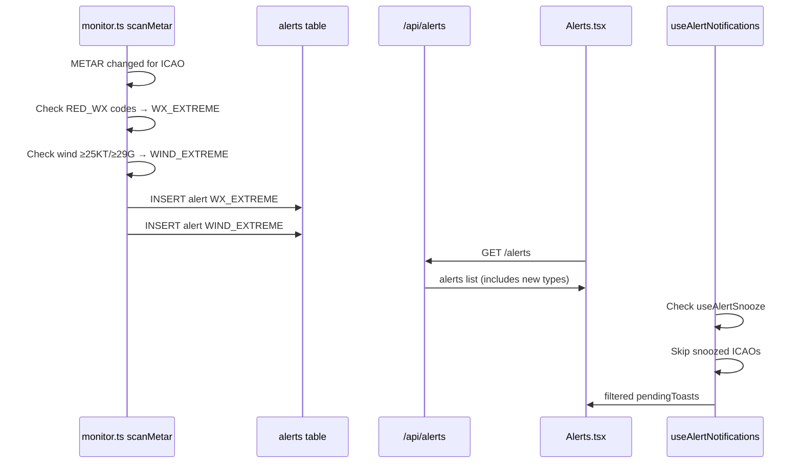

# Implementation Plan: WX_EXTREME + WIND_EXTREME Backend Alerts & Alert Snooze

## Overview

Two features, surgical changes, preview-only deployment:

1. **WX_EXTREME + WIND_EXTREME** — Backend detects extreme weather/wind in METAR changes and stores as alert types
2. **Alert Snooze** — Frontend-only localStorage-based muting of alerts per-ICAO or globally

---

## Architecture Diagram



---

## Feature 1: WX_EXTREME + WIND_EXTREME

### Step 1: Database Schema + Migration

**File: `lib/db/src/schema/alerts.ts`** (line 5)

Change:
```ts
export const alertTypeEnum = pgEnum("alert_type", ["TAF_AMD", "TAF_COR", "SPECI"]);
```
To:
```ts
export const alertTypeEnum = pgEnum("alert_type", ["TAF_AMD", "TAF_COR", "SPECI", "WX_EXTREME", "WIND_EXTREME"]);
```

**New file: `lib/db/migrations/005_add_wx_wind_extreme.sql`**

```sql
-- Migration 005: Add WX_EXTREME and WIND_EXTREME to alert_type enum
-- Preview only — do NOT run in production yet

ALTER TYPE alert_type ADD VALUE IF NOT EXISTS 'WX_EXTREME';
ALTER TYPE alert_type ADD VALUE IF NOT EXISTS 'WIND_EXTREME';
```

### Step 2: Backend Detection in monitor.ts

**File: `artifacts/api-server/src/lib/monitor.ts`**

Add after the SPECI detection block (line 149-152), inside the `if (sonGorulenMetar[icao] !== rawMetar)` block:

```ts
// ── WX_EXTREME detection ──
const EXTREME_WX_CODES = [
  "+TS", "+TSRA", "+SH", "+SHRA", "+RA", "+DZ",
  "DS", "-DS", "+DS", "SS", "-SS", "+SS",
  "-SN", "SN", "+SN", "-SHSN", "SHSN", "+SHSN",
  "TSSN", "+TSSN", "TSGR", "TSPL",
  "-FZRA", "FZRA", "+FZRA",
  "FZDZ", "-FZDZ", "+FZDZ",
  "FZFG", "FZSN",
  "BLSN", "+BLSN", "-BLSN", "DRSN",
  "-RASN", "RASN", "+RASN",
  "SHGR", "SHGS",
  "IC", "PL", "GR", "GS", "VA", "FC", "SQ", "SG",
];

let hasWxExtreme = false;
for (const code of EXTREME_WX_CODES) {
  const escaped = code.replace(/[+]/g, "\\+");
  if (new RegExp(`(?:^|\\s)${escaped}(?=\\s|$)`).test(rawMetar)) {
    hasWxExtreme = true;
    break;
  }
}
if (hasWxExtreme) {
  await db.insert(alertsTable).values({ type: "WX_EXTREME", icao, rawText: rawMetar, previousRawText });
  console.log(`[monitor] ✅ WX_EXTREME alert for ${icao}`);
}

// ── WIND_EXTREME detection ──
let hasWindExtreme = false;
for (const m of rawMetar.matchAll(/\b(?:\d{3}|VRB)(\d{2,3})(?:G(\d{2,3}))?KT\b/g)) {
  const spd = parseInt(m[1]);
  const gst = m[2] ? parseInt(m[2]) : 0;
  if (spd >= 25 || gst >= 29) { hasWindExtreme = true; break; }
}
if (!hasWindExtreme) {
  for (const m of rawMetar.matchAll(/\b(?:\d{3}|VRB)(\d{2,3})(?:G(\d{2,3}))?MPS\b/g)) {
    const spd = parseInt(m[1]);
    const gst = m[2] ? parseInt(m[2]) : 0;
    if (spd >= 13 || gst >= 15) { hasWindExtreme = true; break; }
  }
}
if (!hasWindExtreme) {
  for (const m of rawMetar.matchAll(/\b(?:\d{3}|VRB)(\d{2,3})(?:G(\d{2,3}))?KMH\b/g)) {
    const spd = Math.round(parseInt(m[1]) * 0.5399568);
    const gst = m[2] ? Math.round(parseInt(m[2]) * 0.5399568) : 0;
    if (spd >= 25 || gst >= 29) { hasWindExtreme = true; break; }
  }
}
if (hasWindExtreme) {
  await db.insert(alertsTable).values({ type: "WIND_EXTREME", icao, rawText: rawMetar, previousRawText });
  console.log(`[monitor] ✅ WIND_EXTREME alert for ${icao}`);
}
```

### Step 3: OpenAPI Spec Update

**File: `lib/api-spec/openapi.yaml`**

Update enum at 3 locations:

1. **`/alerts` GET `type` query param** (line 41):
```yaml
enum: [TAF_AMD, TAF_COR, SPECI, WX_EXTREME, WIND_EXTREME]
```

2. **`Alert.type` schema** (line 202):
```yaml
enum: [TAF_AMD, TAF_COR, SPECI, WX_EXTREME, WIND_EXTREME]
```

3. **`AlertsSummary` schema** — Add optional fields (for future use, not required now):
```yaml
wxExtremeAlerts:
  type: integer
windExtremeAlerts:
  type: integer
```

### Step 4: Regenerate Zod + API Client

Run orval to regenerate:
```bash
cd lib/api-spec && npx orval
```

This will update:
- `lib/api-zod/src/generated/types/alertType.ts`
- `lib/api-zod/src/generated/types/listAlertsType.ts`
- `lib/api-zod/src/generated/types/alertsSummary.ts`
- `lib/api-client-react/src/generated/api.ts`
- `lib/api-client-react/src/generated/api.schemas.ts`

### Step 5: Frontend — AlertBadge.tsx

**File: `artifacts/aero-sentinel/src/components/AlertBadge.tsx`**

Change type union and CONFIG:

```tsx
type AlertType = "TAF_AMD" | "TAF_COR" | "SPECI" | "WX_EXTREME" | "WIND_EXTREME";

const CONFIG: Record<AlertType, { label: string; className: string }> = {
  TAF_AMD:     { label: "TAF AMD",      className: "bg-yellow-500/15 text-yellow-400 border-yellow-500/30" },
  TAF_COR:     { label: "TAF COR",      className: "bg-orange-500/15 text-orange-400 border-orange-500/30" },
  SPECI:       { label: "SPECI",        className: "bg-red-500/15 text-red-400 border-red-500/30" },
  WX_EXTREME:  { label: "WX EXTREME",   className: "bg-purple-500/15 text-purple-400 border-purple-500/30" },
  WIND_EXTREME:{ label: "WIND EXTREME", className: "bg-rose-500/15 text-rose-400 border-rose-500/30" },
};
```

### Step 6: Frontend — Alerts.tsx

**File: `artifacts/aero-sentinel/src/pages/Alerts.tsx`**

Update type, constants, and stat cards:

```tsx
type AlertType = "TAF_AMD" | "TAF_COR" | "SPECI" | "WX_EXTREME" | "WIND_EXTREME";

const ALL_ALERT_TYPES: AlertType[] = ["TAF_AMD", "TAF_COR", "SPECI", "WX_EXTREME", "WIND_EXTREME"];

const TYPE_LABELS: Record<AlertType, string> = {
  TAF_AMD: "TAF AMD",
  TAF_COR: "TAF COR",
  SPECI: "SPECI",
  WX_EXTREME: "WX EXTREME",
  WIND_EXTREME: "WIND EXTREME",
};

const TYPE_COLORS: Record<AlertType, string> = {
  TAF_AMD: "#facc15",
  TAF_COR: "#fb923c",
  SPECI:   "#f87171",
  WX_EXTREME:  "#a855f7",  // purple
  WIND_EXTREME: "#fb7185",  // rose
};
```

Update stat card counts (around line 251-252):
```tsx
const wxExtreme    = alerts.filter((a) => a.type === "WX_EXTREME").length;
const windExtreme  = alerts.filter((a) => a.type === "WIND_EXTREME").length;
```

Add 2 new stat cards for WX_EXTREME and WIND_EXTREME in both mobile (2x3 grid) and desktop flex row.

Update the per-alert card CSS class (line 517):
```tsx
`${
  alert.type === "SPECI" ? "alert-speci" :
  alert.type === "TAF_AMD" ? "alert-taf-amd" :
  alert.type === "TAF_COR" ? "alert-taf-cor" :
  alert.type === "WX_EXTREME" ? "alert-wx-extreme" :
  alert.type === "WIND_EXTREME" ? "alert-wind-extreme" :
  ""
}`
```

### Step 7: Frontend — useAlertNotifications.ts

**File: `artifacts/aero-sentinel/src/hooks/useAlertNotifications.ts`** (line 7-11)

Update TYPE_LABELS:
```tsx
const TYPE_LABELS: Record<string, string> = {
  TAF_AMD: "TAF Revision (AMD)",
  TAF_COR: "TAF Revision (COR)",
  SPECI: "SPECI Alert",
  WX_EXTREME: "Extreme Weather",
  WIND_EXTREME: "Extreme Wind",
};
```

### Step 8: API Server — alerts.ts summary route

**File: `artifacts/api-server/src/routes/alerts.ts`**

Update the summary query (around line 141-147) to add counts for new types:
```ts
const [agg] = await db.select({
  total:            sql<number>`COUNT(*)::int`,
  unacknowledged:   sql<number>`COUNT(*) FILTER (WHERE ${alertsTable.acknowledged} = false)::int`,
  tafRevisions:     sql<number>`COUNT(*) FILTER (WHERE ${alertsTable.type} IN ('TAF_AMD', 'TAF_COR'))::int`,
  speciAlerts:      sql<number>`COUNT(*) FILTER (WHERE ${alertsTable.type} = 'SPECI')::int`,
  wxExtremeAlerts:  sql<number>`COUNT(*) FILTER (WHERE ${alertsTable.type} = 'WX_EXTREME')::int`,
  windExtremeAlerts:sql<number>`COUNT(*) FILTER (WHERE ${alertsTable.type} = 'WIND_EXTREME')::int`,
  airportsAffected: sql<number>`COUNT(DISTINCT ${alertsTable.icao})::int`,
}).from(alertsTable).where(and(...baseConditions));
```

Update the result object to include the new fields.

---

## Feature 2: Alert Snooze (Frontend-Only, localStorage)

### Step 9: New Hook — useAlertSnooze.ts

**New file: `artifacts/aero-sentinel/src/hooks/useAlertSnooze.ts`**

```ts
import { useState, useCallback, useEffect } from "react";

const SNOOZE_KEY = "aero-alert-snooze-v1";

export interface SnoozeEntry {
  icao: string;       // "__GLOBAL__" for all-airport snooze
  until: number;      // UTC timestamp when snooze expires
  createdAt: number;
}

type SnoozeDuration = "1h" | "4h" | "8h" | "24h";

const DURATION_MS: Record<SnoozeDuration, number> = {
  "1h":  1 * 60 * 60 * 1000,
  "4h":  4 * 60 * 60 * 1000,
  "8h":  8 * 60 * 60 * 1000,
  "24h": 24 * 60 * 60 * 1000,
};

function loadSnoozes(): SnoozeEntry[] {
  try {
    const raw = localStorage.getItem(SNOOZE_KEY);
    if (!raw) return [];
    const arr = JSON.parse(raw);
    if (!Array.isArray(arr)) return [];
    // Filter expired entries on load
    const now = Date.now();
    return arr.filter((s: SnoozeEntry) => s.until > now);
  } catch { return []; }
}

function saveSnoozes(entries: SnoozeEntry[]) {
  try {
    localStorage.setItem(SNOOZE_KEY, JSON.stringify(entries));
  } catch { /* ignore */ }
}

export function useAlertSnooze() {
  const [snoozes, setSnoozes] = useState<SnoozeEntry[]>(loadSnoozes);

  // Clean expired entries periodically
  useEffect(() => {
    const interval = setInterval(() => {
      setSnoozes(prev => {
        const now = Date.now();
        const clean = prev.filter(s => s.until > now);
        if (clean.length !== prev.length) saveSnoozes(clean);
        return clean;
      });
    }, 60_000);
    return () => clearInterval(interval);
  }, []);

  const snooze = useCallback((icao: string, duration: SnoozeDuration) => {
    setSnoozes(prev => {
      const filtered = prev.filter(s => s.icao !== icao);
      const entry: SnoozeEntry = {
        icao,
        until: Date.now() + DURATION_MS[duration],
        createdAt: Date.now(),
      };
      const next = [...filtered, entry];
      saveSnoozes(next);
      return next;
    });
  }, []);

  const snoozeAll = useCallback((duration: SnoozeDuration) => {
    snooze("__GLOBAL__", duration);
  }, [snooze]);

  const unsnooze = useCallback((icao: string) => {
    setSnoozes(prev => {
      const next = prev.filter(s => s.icao !== icao);
      saveSnoozes(next);
      return next;
    });
  }, []);

  const unsnoozeAll = useCallback(() => {
    setSnoozes([]);
    saveSnoozes([]);
  }, []);

  const isSnoozed = useCallback((icao: string): boolean => {
    const now = Date.now();
    return snoozes.some(s => (s.icao === icao || s.icao === "__GLOBAL__") && s.until > now);
  }, [snoozes]);

  const isGloballySnoozed = useCallback((): boolean => {
    const now = Date.now();
    return snoozes.some(s => s.icao === "__GLOBAL__" && s.until > now);
  }, [snoozes]);

  const getSnoozeExpiry = useCallback((icao: string): number | null => {
    const now = Date.now();
    const entry = snoozes.find(s => (s.icao === icao || s.icao === "__GLOBAL__") && s.until > now);
    return entry ? entry.until : null;
  }, [snoozes]);

  return {
    snooze,
    snoozeAll,
    unsnooze,
    unsnoozeAll,
    isSnoozed,
    isGloballySnoozed,
    getSnoozeExpiry,
    snoozes,
  };
}
```

### Step 10: Integrate Snooze into useAlertNotifications.ts

**File: `artifacts/aero-sentinel/src/hooks/useAlertNotifications.ts`**

Import the snooze hook and filter snoozed alerts before creating toasts/notifications:

At the top, add import:
```ts
import { useAlertSnooze } from "@/hooks/useAlertSnooze";
```

Inside the hook body (after line 64):
```ts
const { isSnoozed } = useAlertSnooze();
```

In the notification loop (around line 179), add snooze check after watchlist filter:
```ts
// Snooze filter
if (isSnoozed(alert.icao)) {
  skippedCount++;
  seenIds.current.add(alert.id);
  continue;
}
```

### Step 11: Snooze UI in Alerts.tsx

**File: `artifacts/aero-sentinel/src/pages/Alerts.tsx`**

Import and use the snooze hook:

```tsx
import { useAlertSnooze } from "@/hooks/useAlertSnooze";
```

Inside the component:
```tsx
const { snooze, snoozeAll, unsnooze, isSnoozed, isGloballySnoozed, getSnoozeExpiry } = useAlertSnooze();
```

Add snooze state for UI:
```tsx
const [snoozeMenuIcao, setSnoozeMenuIcao] = useState<string | null>(null);
```

**Global snooze button** — Add next to "ACK All" button in the filter bar:
```tsx
{isGloballySnoozed() ? (
  <button onClick={unsnoozeAll} className="filter-btn"
    style={{ borderColor: "rgba(168,85,247,0.6)", color: "#a855f7", backgroundColor: "rgba(168,85,247,0.12)" }}>
    🔔 UNSNOOZE ALL
  </button>
) : (
  <button onClick={() => snoozeAll("4h")} className="filter-btn"
    style={{ borderColor: "rgba(168,85,247,0.4)", color: "#a855f7", backgroundColor: "rgba(168,85,247,0.08)" }}>
    🔕 SNOOZE ALL 4h
  </button>
)}
```

**Per-alert snooze button** — Add next to ACK button on each alert card:
```tsx
{isSnoozed(alert.icao) ? (
  <button onClick={() => unsnooze(alert.icao)}
    className="px-2 sm:px-3 py-1.5 sm:py-2 rounded-full border text-[10px] sm:text-xs font-mono font-bold tracking-wider transition-all"
    style={{ borderColor: "rgba(168,85,247,0.6)", color: "#a855f7", backgroundColor: "rgba(168,85,247,0.12)" }}>
    🔔 UNSNOOZE
  </button>
) : (
  <button onClick={() => setSnoozeMenuIcao(alert.icao)}
    className="px-2 sm:px-3 py-1.5 sm:py-2 rounded-full border text-[10px] sm:text-xs font-mono font-bold tracking-wider transition-all"
    style={{ borderColor: "rgba(168,85,247,0.4)", color: "#a855f7", backgroundColor: "rgba(168,85,247,0.08)" }}>
    🔕 SNOOZE
  </button>
)}
```

**Snooze duration popup** — Floating dropdown when snoozeMenuIcao is set:
```tsx
{snoozeMenuIcao && (
  <div className="fixed inset-0 z-50 flex items-center justify-center" onClick={() => setSnoozeMenuIcao(null)}>
    <div className="bg-card border border-border rounded-xl p-4 shadow-2xl space-y-2"
      onClick={(e) => e.stopPropagation()}>
      <p className="text-xs font-mono font-bold text-foreground mb-2">Snooze {snoozeMenuIcao}</p>
      {(["1h", "4h", "8h", "24h"] as const).map((d) => (
        <button key={d} onClick={() => { snooze(snoozeMenuIcao, d); setSnoozeMenuIcao(null); }}
          className="block w-full text-left px-3 py-1.5 rounded text-xs font-mono hover:bg-muted transition-colors">
          {d}
        </button>
      ))}
    </div>
  </div>
)}
```

**Snooze status indicator** — Show on snoozed alert cards:
```tsx
{isSnoozed(alert.icao) && (
  <span className="text-[10px] sm:text-xs bg-purple-500/15 text-purple-400 font-mono px-1.5 sm:px-2 py-0.5 rounded border border-purple-500/30">
    SNOOZED
  </span>
)}
```

Filter snoozed alerts from the displayed list (optional — could just dim them):
```tsx
// In the alerts useMemo, add after hideAcknowledged filter:
// Option A: Hide snoozed completely
// list = list.filter((a) => !isSnoozed(a.icao));
// Option B: Show snoozed but dimmed (preferred — already handled by SNOOZED badge)
```

---

## Implementation Order

| # | Phase | File | Change |
|---|-------|------|--------|
| 1 | DB | `lib/db/src/schema/alerts.ts` | Add WX_EXTREME, WIND_EXTREME to enum |
| 2 | DB | `lib/db/migrations/005_add_wx_wind_extreme.sql` | New migration file |
| 3 | API Spec | `lib/api-spec/openapi.yaml` | Add new types to enums |
| 4 | Codegen | Run `npx orval` | Regenerate Zod + React client |
| 5 | Backend | `artifacts/api-server/src/lib/monitor.ts` | Add detection logic in scanMetar |
| 6 | Backend | `artifacts/api-server/src/routes/alerts.ts` | Update summary counts |
| 7 | Frontend | `artifacts/aero-sentinel/src/components/AlertBadge.tsx` | Add new badge configs |
| 8 | Frontend | `artifacts/aero-sentinel/src/hooks/useAlertNotifications.ts` | Add TYPE_LABELS |
| 9 | Frontend | `artifacts/aero-sentinel/src/pages/Alerts.tsx` | Add types, filters, stat cards |
| 10 | Frontend | `artifacts/aero-sentinel/src/hooks/useAlertSnooze.ts` | **New file** — snooze hook |
| 11 | Frontend | `artifacts/aero-sentinel/src/hooks/useAlertNotifications.ts` | Integrate snooze filtering |
| 12 | Frontend | `artifacts/aero-sentinel/src/pages/Alerts.tsx` | Add snooze UI |
| 13 | CSS | Global stylesheet | Add `.alert-wx-extreme`, `.alert-wind-extreme` styles |

---

## Key Detection Logic Reference

### WX_EXTREME Codes (from metarParser.ts RED_WX set)
```
+TS, +TSRA, +SH, +SHRA, +RA, +DZ,
DS, -DS, +DS, SS, -SS, +SS,
-SN, SN, +SN, -SHSN, SHSN, +SHSN,
TSSN, +TSSN, TSGR, TSPL,
-FZRA, FZRA, +FZRA, FZDZ, -FZDZ, +FZDZ,
FZFG, FZSN, BLSN, +BLSN, -BLSN, DRSN,
-RASN, RASN, +RASN, SHGR, SHGS,
IC, PL, GR, GS, VA, FC, SQ, SG
```

### WIND_EXTREME Thresholds (from metarParser.ts hasBadgeWind)
| Unit | Sustained | Gust |
|------|-----------|------|
| KT | ≥ 25 | ≥ 29 |
| MPS | ≥ 13 | ≥ 15 |
| KMH | ≥ 25 kt equiv (≥46 KMH) | ≥ 29 kt equiv (≥54 KMH) |

---

## Risks & Mitigations

| Risk | Mitigation |
|------|------------|
| Enum value can't be added to existing pgEnum in production without migration | Migration uses `ADD VALUE IF NOT EXISTS` — safe to run |
| Multiple alerts per METAR change (WX + WIND + SPECI) | By design — each is independent; dedup in frontend keeps latest per ICAO |
| Snooze in localStorage — lost on clear browser data | Acceptable for v1; can migrate to backend later |
| Orval codegen may break existing generated types | Preview only; run codegen, verify diff before merge |
